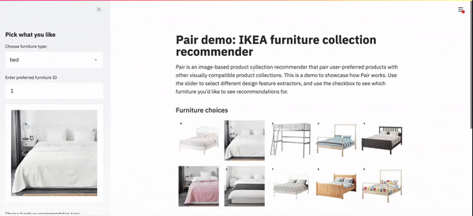

Pair is an image-based product recommender for matching visually similar products across categories. User provides an image of a preferred furniture, and the model will return furniture from another categories that have similar design. Pair uses a convolutional neural network (VGG16) to learn subtle design elements of furnitures and save the design features in a library. As the customer's preferred image is fed in, the image is queried against the design feature library to obtain product recommendations.

This repository contains 3 main components:  

1. [__Inference module__](#inference-module) (`pair/`): The main recommender engine. It generates design feature extractors and makes furniture recommendations based on user input images  
2. [__Training module__](#training-module) (`trainer/`): It performs transfer learning on a pre-trained VGG16 network to learn to classify furnitures based on the type of rooms they may appear in. The purpose is to improve the design feature extractors so it can better recognize complementary furnitures  
3. [__Streamlit app__](#streamlit-app) (`run_streamlit_app.py`): A demo of Pair built using the streamlit package (go [here](http://bit.ly/pair-demo) for live demo)

## Inference module
### Installation
The model is tested on Python 3.6, with dependencies listed in `requirements.txt`. A few options to run the Pair install these Python dependencies, please run 
> `pip install -r requirements.txt` 

Or if you prefer to use conda, 
> `conda install --file requirements.txt`

### Usage

To get a sample recommendation, please run:

> `python run_pair.py`

The first time you run inference you will have to generate the feature embeddings, which will take \~30 seconds for each furniture type. If you'd like to play around with different images, please change parameters in `config.yml` and re-run `run_pair.py`. 

The prototype will take as input path to an image of a table and the model will recommend different chairs based on the table's style and content. Result image will be saved in the `./output/pair-output.png`. Inference time is on the order of seconds. 

## Training module
### Installation 
Once the dependencies are installed, you are ready to go! Alternatively, to build the development environment from a Docker image (takes \~5 minutes), run
> `docker build -t pair-trainer:v1 -f Dockerfile.pair .`

To run the Docker image interactively from the shell, run the image while mounting relevant volumes
> `docker run -it 
--mount src=./data,target=/tmp/data,type=bind
--mount src=./output,target=/tmp/output,type=bind
--mount src=./pair,target=/tmp/pair,type=bind
--mount src=./trainer,target=/tmp/trainer,type=bind
pair-trainer:v1`

### Usage
To run transfer learning module, run
> `python -m trainer.task --data-dir './data/' --out-dir './output/' --num-epochs 25 --test-size 0.1`
## Streamlit app

 
	

### Installation

To run the demo, make sure streamlit is installed, then simply run 
> `streamlit run streamlit_app.py`

To create a containerized application, comment out `faiss-cpu` in `requirements.txt` then run
> `docker build -t pair-streamlit:v1 -f Dockerfile.streamlit .`

## Credits

### Dataset
The IKEA catalog image dataset from Ivona Tautkute et al. ([IKEA image dataset](https://github.com/yuanhunglo/ikea)) is used to create the minimal viable product.

### Codes
This project is built on top of   
* Austin McKay's [Style Stack repo](https://github.com/TheAustinator/style-stack)  
* Inspired by Greg Surma's [Style Transfer repo](https://github.com/gsurma/style_transfer/blob/master/style-transfer.ipynb) 
